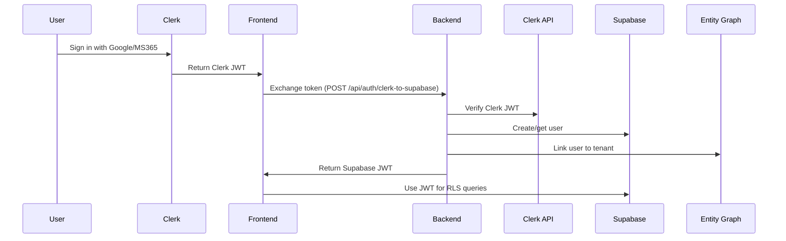

# 🔐 CLERK + SUPABASE HYBRID AUTH SETUP

## 📋 **OVERVIEW**

This guide enables **enterprise SSO** via Clerk while maintaining **RLS security** via Supabase.

### **Why Hybrid?**
- ✅ Clerk: Enterprise SSO (Google Workspace, Microsoft 365, SAML)
- ✅ Supabase: Database RLS policies + multi-tenant isolation
- ✅ Best of both: Enterprise auth + database security

---

## 🚀 **IMPLEMENTATION STEPS**

### **1. Install Clerk Dependencies**

```bash
npm install @clerk/clerk-react @clerk/clerk-sdk-node jsonwebtoken
npm install --save-dev @types/jsonwebtoken
```

---

### **2. Update Main App Entry**

**Replace `src/main.tsx`:**

```typescript
import React from 'react';
import ReactDOM from 'react-dom/client';
import { ClerkSupabaseProvider } from './context/ClerkSupabaseProvider';
import { AuthProvider } from './context/AuthContext';
import App from './App';
import './index.css';

ReactDOM.createRoot(document.getElementById('root')!).render(
  <React.StrictMode>
    <ClerkSupabaseProvider>
      <AuthProvider>
        <App />
      </AuthProvider>
    </ClerkSupabaseProvider>
  </React.StrictMode>
);
```

---

### **3. Environment Variables**

**Add to `.env.local`:**

```env
# Clerk (Frontend)
VITE_CLERK_PUBLISHABLE_KEY=pk_test_...

# Clerk (Backend)
CLERK_SECRET_KEY=sk_test_...

# JWT Signing (for custom Supabase tokens)
JWT_SECRET=your-secure-random-secret
```

**Get Clerk Keys:**
1. Go to: https://dashboard.clerk.com/
2. Navigate to: API Keys
3. Copy `Publishable Key` and `Secret Key`

---

### **4. How It Works**



---

### **5. User Onboarding Flow**

**When a new user signs in via Clerk:**

1. **Frontend detects new Clerk user**
2. **Backend creates Supabase user** (same email)
3. **Backend creates `entity_graph` entry** (no tenant yet)
4. **User completes onboarding** (creates/joins tenant)
5. **Backend updates `entity_graph.tenant_id`**
6. **RLS policies start enforcing isolation**

---

### **6. Testing the Hybrid Setup**

**A) Test Clerk Login:**

```bash
npm run dev
# Navigate to: http://localhost:5174
# Click "Sign in with Google"
# Should redirect to Clerk → Google → back to app
```

**B) Verify Supabase Sync:**

```typescript
// In browser console after login:
const { data: { user } } = await supabase.auth.getUser();
console.log(user); // Should show Supabase user with Clerk email
```

**C) Test RLS:**

```typescript
// Should only see own tenant data
const { data } = await supabase.from('tenants').select('*');
console.log(data); // Should return 1 row (your tenant)
```

---

### **7. Enterprise SSO Configuration**

**Enable Google Workspace SSO:**

1. Go to: Clerk Dashboard → Social Connections
2. Enable "Google"
3. Configure OAuth settings
4. Add authorized domain: `your-domain.com`

**Enable Microsoft 365 SSO:**

1. Go to: Clerk Dashboard → Social Connections
2. Enable "Microsoft"
3. Follow Microsoft Entra ID setup guide

**Enable SAML (Enterprise only):**

1. Go to: Clerk Dashboard → Enterprise Connections
2. Add SAML connection
3. Configure with customer's Identity Provider

---

### **8. Security Considerations**

**A) Token Expiration:**

```typescript
// Clerk tokens expire after 1 hour
// Supabase custom JWTs expire after 1 hour
// Auto-refresh handled by ClerkSupabaseSync
```

**B) Revocation:**

```typescript
// When user signs out from Clerk:
await clerk.signOut();
await supabase.auth.signOut();
```

**C) Audit Logging:**

```sql
-- Log all auth exchanges
CREATE TABLE auth_sync_logs (
  id UUID PRIMARY KEY DEFAULT gen_random_uuid(),
  clerk_user_id TEXT NOT NULL,
  supabase_user_id UUID NOT NULL,
  sync_type TEXT NOT NULL,
  success BOOLEAN NOT NULL,
  error_message TEXT,
  created_at TIMESTAMPTZ DEFAULT NOW()
);
```

---

### **9. Migration from Supabase Auth Only**

**For existing users:**

```typescript
// Backend endpoint to link Clerk account
app.post("/api/auth/link-clerk-account", async (req, res) => {
  const { supabaseUserId, clerkUserId } = req.body;
  
  // Update Supabase user metadata
  await supabaseAdmin.auth.admin.updateUserById(supabaseUserId, {
    user_metadata: { clerk_id: clerkUserId }
  });
  
  res.json({ success: true });
});
```

---

### **10. Troubleshooting**

**Issue: "Invalid JWT"**
- Check `JWT_SECRET` matches between sign and verify
- Verify Supabase project accepts custom JWTs

**Issue: "User not found in entity_graph"**
- Ensure user completed onboarding
- Check `auth_user_id` matches Supabase user ID

**Issue: "RLS policies blocking queries"**
- Verify `tenant_id` is set in `entity_graph`
- Check `kora_current_tenant_id()` returns correct UUID

---

### **11. Production Checklist**

Before deploying hybrid auth:

- [ ] Clerk production keys configured
- [ ] JWT secret is cryptographically random (32+ chars)
- [ ] CORS allows Clerk domains
- [ ] SSL/TLS enabled on all endpoints
- [ ] Token refresh logic tested
- [ ] Sign-out flow clears both sessions
- [ ] Audit logging enabled
- [ ] Error tracking for auth failures

---

## 📊 **COMPARISON**

| Feature | Supabase Auth Only | Clerk Hybrid |
|---------|-------------------|--------------|
| Email/Password | ✅ | ✅ |
| Social Login | ✅ Basic | ✅ Advanced |
| Enterprise SSO | ❌ | ✅ |
| SAML/SCIM | ❌ | ✅ |
| User Management UI | Basic | ✅ Advanced |
| MFA | ✅ | ✅ |
| Session Management | ✅ | ✅ Enhanced |
| RLS Integration | ✅ Native | ✅ Custom |

---

## 🎯 **RECOMMENDATION**

**Use Supabase Auth Only if:**
- Building MVP/startup
- No enterprise SSO needed
- Budget-conscious

**Use Clerk Hybrid if:**
- Targeting enterprise customers
- Need Google Workspace/MS365 SSO
- Want advanced user management

---

**Last Updated:** June 6, 2026
**Status:** Ready for Implementation
